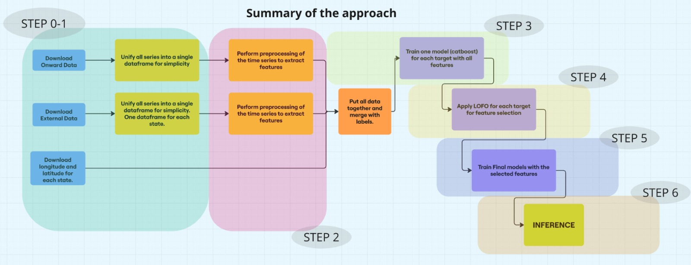

# APPROACH

Things to highlight about the approach:

* Model used for its speed in training large amounts of data and its good results: Catboost
* Automation of downloading and processing of external data
* Performing feature selection with LOFO (Leave One Feature Out)
* Testing of more than 5000 features

In the image below you can see the main steps of the approach.

Now I will describe the steps of the approach step by step.

## STEP 0-1 (DOWNLOAD AND STORE INFORMATION)

1. **Download all the onward data** (from https://thinkonward.com/app/c/challenges/building-instinct/data) and put all the series in a single dataframe for the train and a single dataframe for the test.

2. **Download the external data** (from data lake https://data.openei.org/submissions/4520) that we have in the data_lake (we could have downloaded more data, but the data indicated in run.py seems more than enough to have an optimal score).

    To download the external data, a script has been written that is responsible for downloading this data state by state; so that when you download a state you keep the relevant information, you put all the series in a single dataframe and delete the downloaded raw data to avoid memory problems.

3. Download longitude and latitude for each state (from https://www.kaggle.com/datasets/tennerimaheshwar/us-state-and-territory-latitude-and-longitude-data).

## STEP 2 (EXTRACT FEATURES)

The extraction of variables will consist of extracting aggregations based on temporal parameters (month, week, hour, every 15 minutes, etc...) to see which variables are the most useful to predict each of the classes.

Therefore, as we have a lot of data, we will perform these aggregations by type of variable and in batches to avoid memory problems.

Based on many tests we will make the aggregations for these 4 main variables that seem to be especially useful:

- energy : this is the raw variable known as 'out.electricity.total.energy_consumption'
- energy_diff_abs_1: this the difference in energy between one instance and the next
- energy_diff_abs_2: this the difference in energy between one instance and two next
- energy_div_1: this is the division between the next instant and the previous one.

For each of these variables we will extract 707 variables. Therefore we will have a total of 707*4 (2828) variables plus the three of (state, longitude, latitude).

## STEP 3 (TRAIN WITH ALL FEATURES)

The next step is to train all the models with all the variables.

* A binary model to differentiate between commercial and residential.

* 11 models for commercial metadata.

* 13 models for residential metadata.

In all models we will use catboost with a multiclass objective and in all we will use early_stopping to know the ideal number of iterations. The validation that we will use will be the training data that onward gives us and as training data we will use all the external data.

## STEP 4 (APPLY LOFO FOR FEATURE SELECTION)

Once we have the models trained on all the variables.

We apply `lofo.py` script to decide which variables provide predictive power and which do not. We do this for both commercial and residential mtadata models.
For the initial binary model, a more manual process was performed.

In lofo what is done is input random values to a variable, do the inference again and see if the f1-score has improved or worsened; This will allow us to know if that variable had any predictive value or not.

## STEP 5 (TRAIN WITH SELECTED FEATURES)

Once we have the order of importance of all the variables for each target, we can train the final models with the selected features.

**Training details**, for each target we train the same model 3 times with slightly different parameters:

                        'loss_function' : 'MultiClass',
                        "eval_metric": 'TotalF1:average=Macro',
                        'l2_leaf_reg': 4.6,
                         'random_state': 0,
                         'learning_rate': 0.179,
                         'bagging_temperature': 0.064,
                         'random_strength': 9.57,
                         'iterations': 4695,
                         'depth': random.randint(5, 8),
                         'border_count': random.randint(50, 125),
                        'task_type': "GPU",

The parameters are not tuned at all, since the main way to improve results was the creation of new variables and adding new data.

## STEP 6 (INFERENCE ON UNSEEN DATA)

To perform inference on new data, you can see the last step on `runs.py`:

#### Define parameters
      TEST_DIRECTORY = './data/onward/building-instinct-test-data' # Where is the time series you want to predict
      SAVE_TEST = './private_onward' # Where to save the unified file
      name_file = 'test_private_onward' # Name of the final unified file

#### Group all series in one dataframe
      group_series_single_dataframe(TEST_DIRECTORY, SAVE_TEST, name_file)
#### Extract features and stroe it
      os.system('python ./src/preprocess.py --read_dir ./private_onward --save_dir ./private_onward/data_ready')

#### Run inference
      os.system('python inference.py --read_dir ./private_onward/data_ready')

