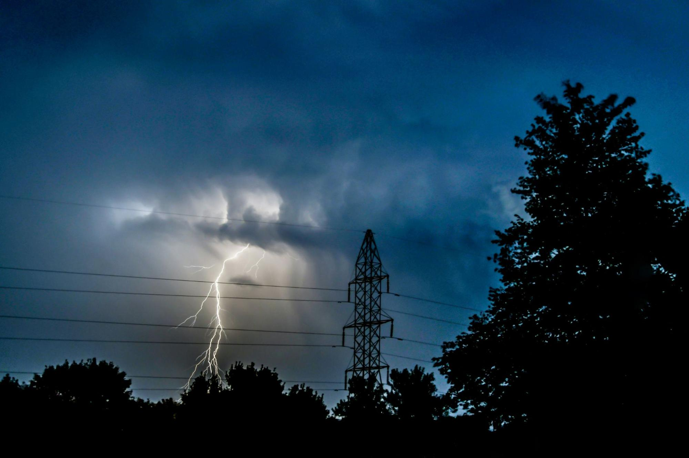
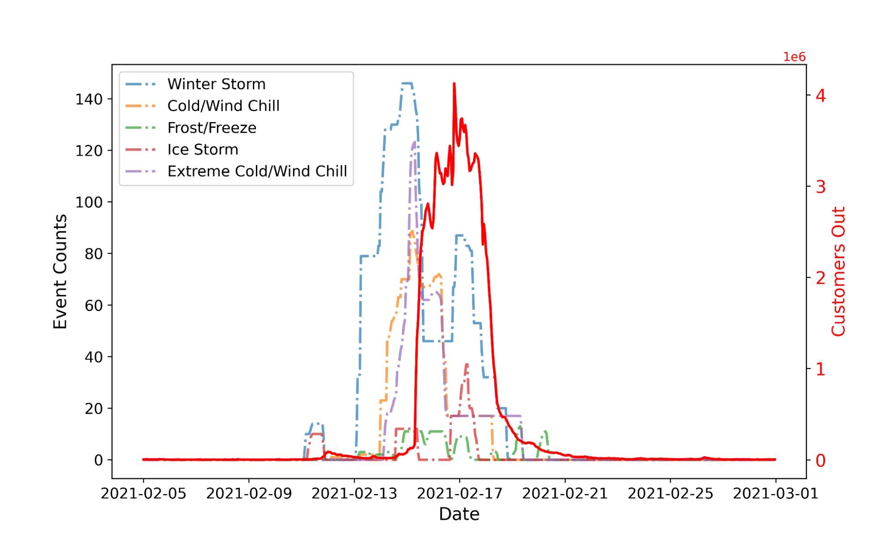

# Dynamic Rhythms

## 🗒️ Description

This repository contains the winning submissions for the data science challenge [Dynamic Rhythms](https://thinkonward.com/app/c/challenges/dynamic-rhythms) held by [Think Onward](https://thinkonward.com) which ran from February to May 2025. 

**The final submissions in this repository are all open source**. This should help inspire you to build on this work, amplify the impact of it by sharing your solutions with the global community, and encourage peer review and collaboration.

## ℹ About the challenge

### 🙋 Introduction

Predicting power outages is crucial for utility companies, emergency responders, and customers to minimize the impact of disruptions. 
During natural disasters and extreme weather events, power infrastructure is at high risk (Figure 1), making accurate predictions vital for preparedness and resilience. 

*Figure 1. This figure depicts the number of Texas customers experiencing power outages over time, and the occurrence of five storm events during the Great Texas Freeze in February 2021. This highlights the significant impact of severe storms on the power grid.*

### 🏗️ Challenge Structure

This was an unstructured challenge, which means that the task was rather open ended. Challengers were asked to use unsupervised learning methods to do some or all of the following:

* Build a model to capture whether and where an outage occurs, and also predict it sufficiently early to allow proactive measures
* Model the severity and duration of outages to assess potential impacts on communities

### 💽 Data

For this Challenge there were two public datasets. The first dataset includes power outages in the U.S. from 2014 to 2023, 
containing information on the number of customers without power every 15 minutes at the county level. 
The second dataset covers storm events in the U.S. from 2014 to 2024, compiled from NOAA’s storm event database. This is a subset of a larger dataset available via NOAA’s storm events database website.

### 📏 Evaluation

In this unstructured challenge, participants were tasked to create a Jupyter Notebook that best addressed the evaluation criteria below and judged by the ThinkOnward panel of judges.

#### Data Handling & Preprocessing (20%):

* How well participants clean, merge, and align multiple data sources (e.g., EAGLE-i outage data, NOAA storm events, ERA5, etc.).
* Treatment of missing values, time alignment (for forecast lead times), and spatial aggregation.
* Understanding the data and problem complexity via EDA and basic statistics

#### Feature Engineering & Justification (15%):

* Creating meaningful features that capture meteorological indicators, location-based attributes, and temporal trends (e.g., lead-lag features for storms).
* Clear reasoning behind feature selection and relevance to power outages.

#### Model Development & Performance (40%):

* Choice of models/algorithms and suitability for rare event forecasting (classification/regression/time-series).
* Handling spatio-temporal aspects, severity (duration/size) of outages, and lead-time predictions.
* Evidence of rigorous evaluation (using performance metrics relevant to rare events, e.g., recall, lead-time error, etc.).

#### Interpretability & Insights (15%):

* Ability to explain the model’s predictions (e.g., which features are most influential).
* Domain insights: demonstrating an understanding of how/why certain storms correlate with outages.

#### Solution Clarity & Reproducibility (10%):

* Code organization, clarity, documentation, and reproducibility.
* Overall adherence to submission guidelines, including external data usage and licensing compliance.

### 👏 Knowledge Sharing
In keeping with our goal of collaboration and knowledge sharing, the winners solutions for this challenge are available in this directory for you to learn from and grow as a data scientist in the energy space. Remember to include license files and acknowledgements as part of the open-source community. 
