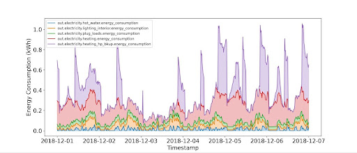
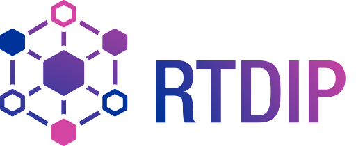

# The Energy-Efficient Ghosts of Holiday Past

## 🗒️ Description

This repository contains the winning submissions for the data science challenge [The Energy-Efficient Ghosts of Holiday Past](https://thinkonward.com/app/c/challenges/ghosts-of-holidays-past) held by [Think Onward](https://thinkonward.com) which ran from December 2023 to March 2024. 

**The final submissions in this repository are all open source**. This should help inspire you to build on this work, amplify the impact of it by sharing your solutions with the global community, and encourage peer review and collaboration.

## ℹ About the challenge

### 🙋 Introduction

Ebenezer Scrooge, much to their dislike, was throwing a Holiday Party for everyone in Scrooge and Marley Inc. at his house in Late December. Tiny Tim requested lights, inflatable decorations, a whole turkey and ham, figgy pudding, and more. Ebenezer couldn't resist such a request, but his penny-pinching never stops, so he was preoccupied with the question, **WHEN** could he have this Party so that he could have the lowest possible electricity bill? Old Scrooge has a knack for accounting but not for data science, which is where the winners came in. The goal of this challenge was to identify the cheapest 4-hour window to hold the Party and calculate the additional cost of electricity in Scrooge's house during that Party.

Another goal for this challenge, because Scrooge was in a giving spirit, was to build a solution using the open-source Real Time Data Ingestion Platform (RTDIP). This open-source platform enables the ingestion, cleaning, and utilization of sensor data ([link](https://rtdip.io)).

### 🏗️ Challenge Structure

At the core of this challenge, participants had two goals: electrical load forecasting and finding novel uses for the RTDIP platform. These  winning solutions included the following:

* Predictions of the load for the Scrooge house for the last six days in December, along with an increase in the load due to the party. 
* Identifying the continuous four-hour window that offers the most cost-effective electricity rates for Scrooge's Party. This window corresponds to the lowest Party cost within a four-hour duration. 
* Using RTDIP functionality somewhere in their solutions.

### 💽 Data

The dataset provided for this challenge comprised time-series load profiles from January 1st to December 21st for 201 residential buildings. Among these buildings, there's Scrooge’s House and 200 other dwelling units. In addition to the load profile dataset, Think Onward provided metadata for the 200 buildings and Scrooge’s House. This metadata comprised valuable details about building characteristics.

Figure 1. Load profiles for five specific loads in the Scrooge House from Dec 1st till the end of Dec 6.

### 🗃️ RTDIP
The Real Time Data Ingestion Platform (RTDIP) is an open-source platform used to support advanced Data Science, statistical and machine learning tasks such as predictive analytics, forecasting, optimization, surveillance as well as other day-to-day operations.

In addition to its data ingestion capabilities, RTDIP enables the transformation of data through common transformations. Furthermore, it supports writing data to multiple end destination data sinks. To get started with RTDIP, please visit the installation page ([link](https://www.rtdip.io/getting-started/installation/)) and follow the steps to install it on your machine. 

### 📏 Evaluation

Evaluation entailed a two-part metric assessment. First, the forecasted party cost was compared to the ground-truth party cost for the submitted four-hour period using the root-mean-square error. Next, the predicted total party cost over the four-hour window was assessed against the optimal total party cost, determining the absolute error. These error values were scaled and combined to generate the final submission error that is reported as the score on the [Predictive Leaderboard](https://thinkonward.com/app/c/challenges/ghosts-of-holidays-past/leaderboard). Lower error scores indicate better solutions. 

### 👏 Knowledge Sharing
RTDIP has an open-source license to build on the open culture of collaboration and knowledge sharing. Open-source licenses are like the Ghosts of Holiday Present, Past, and Future, bringing generous spirits to this challenge and making sure Scrooge continues to share joy, collaboration, and innovation.

