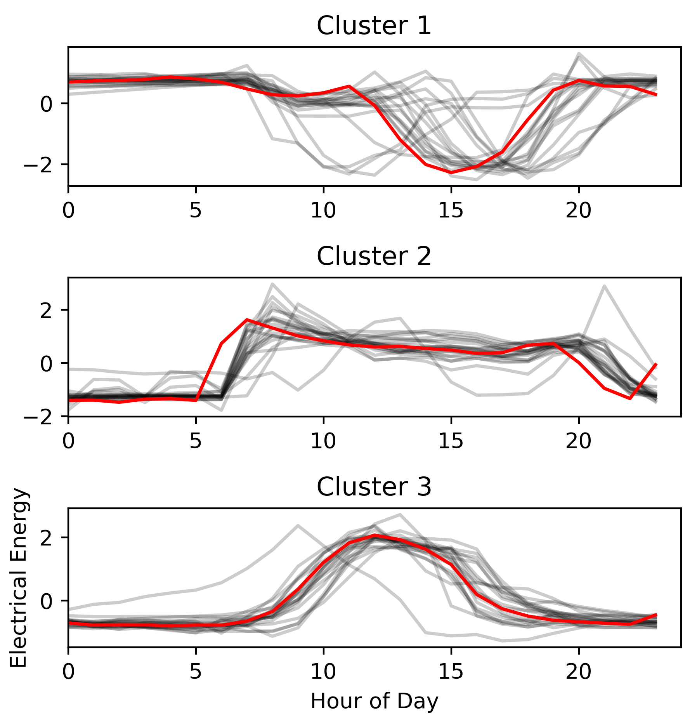
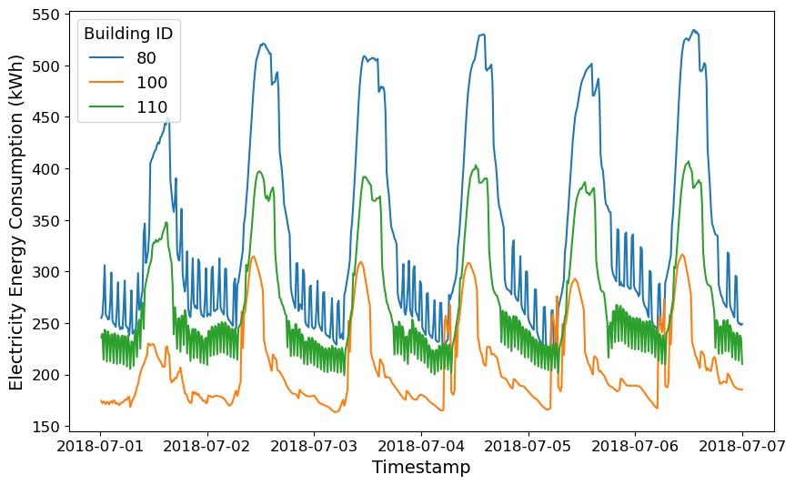

# Power Patterns: Harnessing Electricity for Innovation

## 🗒️ Description

This repository contains the winning submissions for the data science challenge [Power Patterns: Harnessing Electricity for Innovation](https://thinkonward.com/app/c/challenges/power-patterns) held by [Think Onward](https://thinkonward.com) which ran from March to May 2024. 

**The final submissions in this repository are all open source**. This should help inspire you to build on this work, amplify the impact of it by sharing your solutions with the global community, and encourage peer review and collaboration.

## ℹ About the challenge

### 🙋 Introduction

Have you ever wondered when it is least expensive to run your air conditioner in the summer and still stay cool? How about why you often see office buildings with lights left on at night? Electricity is consumed as it is generated, and certain times of day there is more consumption, while at others there is less. Every building has a unique signature in electricity consumption patterns that depends on a variety of factors. A load profile is a data record of a utility customer's electricity consumption patterns over a specific period of time. It ranges from minutes to years and provides valuable insights into when and how energy is being used, allowing electric utility companies to better understand behaviors and preferences. Load profiles record energy usage throughout the day, showing peaks and valleys in energy consumption levels. By analyzing load profiles, electric utilities can identify trends, patterns, and anomalies in energy usage which helps them to make decisions about rate structures, grid management, and demand response strategies. Critically, load profiles can help electric utilities to design and implement time of use tariffs and other demand response programs to optimize energy efficiency, reduce peak demand, and increase the reliability of the electric grid.

Identifying key customer segments with similar load profiles (Figure 1.) allows utilities to target specific groups to participate in demand response initiatives. For example, customers with high energy usage during peak hours could be charged a higher rate to encourage a reduction in consumption during times of high demand. This in turn could alleviate strain and congestion on the grid, and avoid expensive peak energy costs.

Figure 1. Load profiles for three unique clusters in the example dataset.

### 🏗️ Challenge Structure

This was an unstructured challenge, which means that the task was rather open ended. Challengers were asked to use unsupervised learning methods to do some or all of the following:

* Cluster building load profiles for a variety of buildings
* Design a demand response program for a variety of customer segments

### 💽 Data

The dataset provided for this challenge comprised 1,277 timestamped electricity load profiles for buildings for one year from January 1 through December 31. There were also 120 timestamped electicity load profiles for example buildings used in the starter notebook. ThinkOnward also included a file containing some building tags (metadata) for the example files/buildings used in the starter notebook for demonstration purposes only. These data were derived from the End-Use Load Profiles for the U.S. Building Stock data created by the national Renewable Energy Laboratory which are licensed under the CC BY 4.0 license [link](https://creativecommons.org/licenses/by/4.0/) and can be referenced at [https://dx.doi.org/10.25984/1876417](https://dx.doi.org/10.25984/1876417).

### 📏 Evaluation

In this unstructured challenge, participants were tasked to create a Jupyter Notebook that best addressed the evaluation criteria below and judged by the ThinkOnward panel of judges.

#### Unsupervised Learning (25%)

* Is the algorithm selection process well documented in the notebook? Does the selected clustering algorithm suit the data and align with the chosen demand-response (DR) program(s)?
* Are evaluation criteria for the chosen clustering algorithm(s) well explained?
* Does the notebook contain a clear interpretation of the algorithms results, and does it explore the stability and generalizability of the solution?

#### Interpretation (25%)
* Does the notebook draw meaningful conclusions from the analysis and provide insights and recommendations based on the findings?
* Are results clearly explained and connected to the challenge goal?
* Are the demand response program recommendations clearly explained?

#### Exploratory Data Analysis (20%)
* How well does the notebook explain the data pipeline including data loading, cleaning, transformations, and analysis?
* Are appropriate visualizations used to explore and explain the dataset?

#### Feature Engineering and Extraction (20%)
* What features are defined and extracted for training the clustering algorithms? Are both traditional and modern deep learning techniques explored? Are knowledge-based feature engineering explored?
* Does the notebook explain the reasons behind feature engineering and extraction strategies?
* Does the notebook utilize relevant time series analysis techniques to explain the patterns?

#### Notebook Presentation (10%)
* Is the code well documented, easy to understand and reproduce?
* Are all external data sources public and cited correctly?

### 👏 Knowledge Sharing
In keeping with our goal of collaboration and knowledge sharing, the winners solutions for this challenge are available in this directory for you to learn from and grow as a data scientist in the energy space. Remember to include license files and acknowledgements as part of the open-source community. 