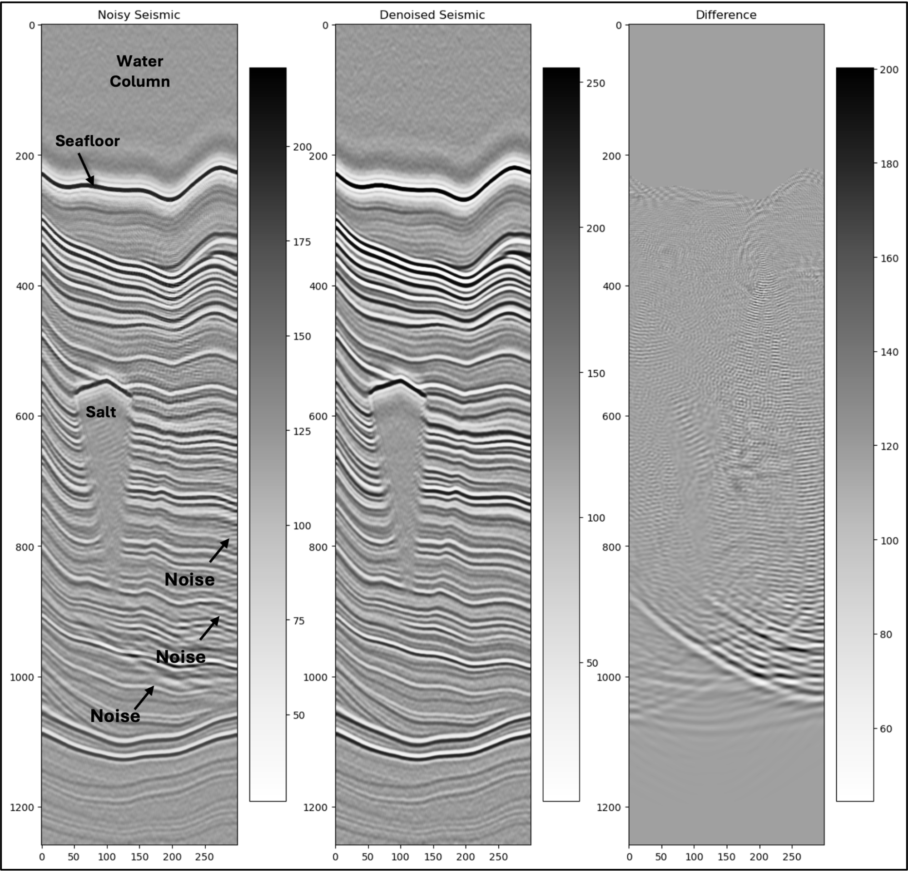

# Image Impeccable: Journey to Clarity

## 🗒️ Description

This repository contains the winning submissions for the[Image Impeccable Data Science Challenge](https://thinkonward.com/app/c/challenges/image-impeccable) held by [Think Onward](https://thinkonward.com) which ran from June to October 2024. 

**The final submissions in this repository are all open source**. This should help inspire you to build on this work, amplify the impact of it by sharing your solutions with the global community, and encourage peer review and collaboration. You can find the winning models on the `image-impeccable` [branch of the ThinkOnward HuggingFace Challenges model page](https://huggingface.co/thinkonward/challenges/tree/image-impeccable) 🤗.

## ℹ About the challenge

### 🙋 Introduction

For this challenge, we’ve provided you with a series of 3D seismic volumes that are in dire need of denoising. Your task, should you choose to accept it, is to build a model that can intake a seismic volume, and denoise the volume in an accurate and efficient manner. 

### 🏗️ Challenge Structure

At first glance, a seismic line might look chaotic to the untrained eye, but upon further inspection, a trained eye can often find many features in data. These features are the products of how the data was collected, the geology, and the data processing methods. Sadly seismic data does not always capture a perfect image of the subsurface. In particular, some features get completely obliterated by noise from the way it was collected, processed, and the geology itself. Much like looking down into a pool from above before making a daring escape from the bad guys, the image can be filled with noise from other sources that obscure the different features. Only by filtering out the noise and focusing on the task at hand do the features become clear.

The acquisition, processing, and interpretation of seismic data is worth a library of textbooks, beyond the scope of this challenge. However, by looking through the data for this challenge, anyone can pick out numerous general trends. Some examples:
- There is often a dull area on the top of the line which represents the water column; much of this data comes from offshore locations.
- Higher frequency reflections are more common in the upper parts of the line, while lower frequencies are more common in the lower parts of the line.
- The black and white layers alternate on the line, these represent changes in density of the rocks being measured just like an image from a medical ultrasound device.
- Salt appears as a bright reflection followed by a dull area of gray with little texture
- Noise often appears as subhorizontal alternating black and white lines, and “smiles” where these noise waves intersect

### 💽 Data

Participants were provided with 500 paired synthetic seismic datasets. Of the 500 volumes 250 volumes are the noisy seismic, and 250 volumes are the target denoised seismic. The synthetic data were delivered as Numpy arrays with a shape of (300,300,1259).    

The Image Impeccable: Journey to Clarity Data by Think Onward are licensed under the CC BY 4.0 license (link)

### 📏 Evaluation

To evaluate the performance of your solution, you will provide a submission file containing six 2D arrays taken from each 3D seismic volume in the test dataset. Instructions and submission file generation code is provided at the bottom of the starter notebook. For this challenge, the leaderboard evaluation will use the scikit-image implementation of the Structural Similarity Index. The Structural Similarity Index is a metric used to measure the similarity between two images. When the SSI equals 1, the images are identical. When the SSI equals 0, the images are completely dissimilar. Please refer to the `scikit-image` docs for more information about the metric, as well as examples of implementation. Similarity will be calculated for all predictions. The minimum and maximum SSI values will be dropped, and the mean SSI score across all predictions will be the final score. 

### 👏 Knowledge Sharing
In keeping with our goal of collaboration and knowledge sharing, the winners solutions for this challenge are available in this directory for you to learn from and grow as a data scientist in the energy space. Remember to include license files and acknowledgements as part of the open-source community. 

