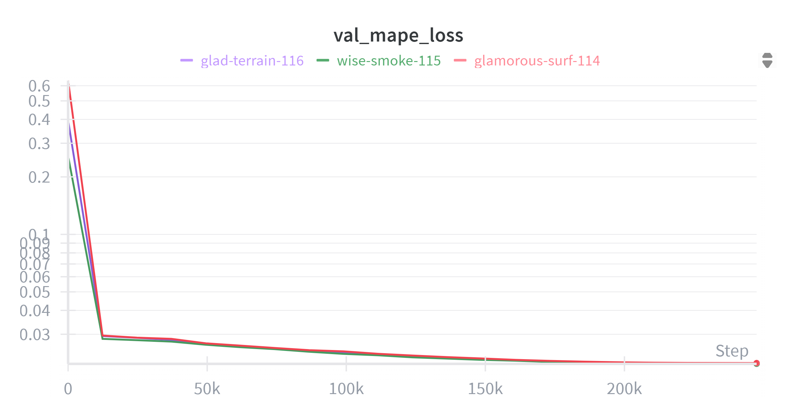

# Speed and Structure Competition Final Submission
## Outline
---
- Installation
- Steps for full reproduction 
  1. EDA
  2. Data Generation
  3. Training
  4. Prediction
- The summary of my approach
  - Synthetic Data Generation
  - Data Preprocessing
  - Model Architecture
  - Training
  - Prediction
  - Possible Improvements
- Working environment

## Installation
---
- Create a virtual environment if you don't have one and activate it
```
conda create -n speed_and_structure python=3.12.11
```
```
conda activate speed_and_structure
```
- Install the requirements
```
pip install -r requirements.txt
```
- Download the pretrained models into the `model_checkpoints` directory
```
cd model_checkpoints
```
```
wget https://huggingface.co/mgoksu/speed-and-structure-net/resolve/main/best_model_43_023536.pt
wget https://huggingface.co/mgoksu/speed-and-structure-net/resolve/main/best_model_44_023772.pt
wget https://huggingface.co/mgoksu/speed-and-structure-net/resolve/main/best_model_45_023476.pt
```

- Download the competition data into the `data` directory so that it looks like this:


## Steps for full reproduction
---
If you only want to reproduce the prediction part, you can skip to the last section. If you want to reproduce the full training, you have to go through all the notebooks. 
### 1. EDA
Assuming you have the data in the `data` directory open `1_eda.ipynb` and run all the cells. This will create a 20-fold cross-validation splits of the data as CSV files where each sample is assigned a fold. 3 CSV files will be generated: one for the first dataset (fold_info.csv), one for the extended dataset (fold_info_extended.csv), and one that includes both (fold_info_all.csv).
### 2. Data Generation
After the EDA, you can go to `2_data_gen.ipynb` and run all the cells. Note that for demonstration, `GEN_N` param is set to 10 here. If you want full reproduction, you should set it to 20000 by uncommenting the line:  
```
# GEN_N = 20000
```
I guess it's possible to run it on the GPU but I wasn't able to get it to work. You can try to parallelize the data generation but it's overall pretty slow on CPU so the data generation will take a long time to run. Once it is completed, you can go to the next step. 

This step will also create a fold info file `fold_info_all_with_synth.csv` that includes all the data plus the synthetic data. This will be used for training. All the synthetic data will have their fold assigned to -1 so that they can never be in any validation fold and will only be in the training data.

My forward simulation doesn't perfectly match the given data but it's pretty close.

The generated data I have is ~135GB in size. I wasn't sure if it makes sense to upload it somewhere. I can share it if requested.

### 3. Training
The training configuration comes from the `config.py`. I ran the `3_train.ipynb` file 3 times and only changed the following line in `config.py` to 1, 2, and 3:
```
cfg.holdout_idx = 3 # 1, 2, 3
```
Each run will save a model to the `model_checkpoints` directory, total of 3. The final submission takes the average of predictions from these 3 models. My pretrained models are uploaded as suggested to Huggingface and available at . The naming format is best_model_{seed}_{MAPE score on the leaderboard}.pt

The MAPE validation loss during my training is as follows for the 3 pretrained models:


The leaderboard and CV results for the 3 pretrained models are as follows:
| Seed | LB MAPE | CV MAPE |
| --- | --- | --- |
| 43 | 0.023536 | 0.021206 |
| 44 | 0.023772 | 0.020997 |
| 45 | 0.023476 | 0.021033 |

### 4. Prediction
Whether you downloaded the pretrained models or you trained your models from scratch, now you can go to `4_predict.ipynb` and run all the cells. It will generate a submission file `speed-and-structure-submission.npz`. Make sure you modified the model paths if you trained your own models.

## The summary of my approach
---
There was a recent and very relevant competition on [Kaggle](https://www.kaggle.com/competitions/waveform-inversion/overview) where the objective was almost the same. Mainly, the input and output shapes, the forward propagation algorithm, and the evaluation metric was different and the available dataset was huge. Other than that, the task is the same so I started with [the most popular public model](https://www.kaggle.com/code/brendanartley/caformer-full-resolution-improved) from that competition and modified it to fit the given dataset. 

### Synthetic Data Generation
- I followed this thread in the competition forum [here](https://forum.thinkonward.com/t/synthatic-data-generation/2388/4) and the devito documentation [here](https://www.devitoproject.org/examples/seismic/tutorials/01_modelling.html). I wasn't able to run the simulation on a GPU so my implementation here is CPU based and probably suboptimal.
- Each new velocity sample is a weighted average of two random original samples. The weight is randomly sampled from a uniform distribution.

$$
V_{new} = w V_1 + (1 - w) V_2
$$
where $w \in [0, 1]$.

This is very loosely inspired by the oversampling method [SMOTE](https://arxiv.org/abs/1106.1813) with k=1. 
- I generated 20000 samples for the competition but I only included them in the training data and not in any validation data.

### Data Preprocessing
- I modified the input at dataloader level by padding the input from (B, 5, T, 31) to (B, 5, T, 32) so that dimensions inside the model work smoothly.
- Following the observation by Harshit Sheoran's first place [solution](https://www.kaggle.com/competitions/waveform-inversion/writeups/harshit-sheoran-1st-place-solution), I reshaped the input from (B, 5, T, 32) to (B, 1, T, 32x5) to "force the channels into a spatial layout".
- I applied Z-score normalization to the input and Min-Max normalization to the target.
- I downsampled the time steps to 2048 by interpolating the data using scipy's interp1d. You can increase this number as much as your GPU memory allows. Small values are more prone to overfitting based on my few experiments.

### Model Architecture
- In the original model, Bartley modifies the internal components of the backbone model (Caformer), adding a lot of padding just to match the output shape, which he commented as not the best approach. Instead, I kept the backbone and the decoder part the same and later applied reducing convolutions and interpolation to match the output shape as following:
```
...
# Decoder
feats = self.decoder(feats) 

target_size = (1259, 300)
reduced = []
for f, reduce_conv in zip(feats, [self.reduce0, self.reduce1, 
                                  self.reduce2, self.reduce3]):
    # 1) reduce channels
    x = reduce_conv(f)                     # (B, fuse_ch, Hi, Wi)
    # 2) upsample spatially
    x = F.interpolate(x, size=target_size, 
                      mode='bilinear', align_corners=False)
    reduced.append(x)                      # (B, fuse_ch, 1259, 300)

# 3) fuse (here: concat along channels → (B,4·fuse_ch,1259,300))
x = torch.cat(reduced, dim=1)
# # 4) project to one channel + squeeze
x = self.seg_head(x).squeeze(1)
...
```
- I applied sigmoid activation to the output in accordance with the Min-Max Normalization.
- I used test time augmentation by flipping the input and the target.
- Just like the original model, I used EMA model during training. See [here](https://timm.fast.ai/training_modelEMA)

### Training
- I trained 3 models with different seeds and different validation splits for 20 epochs. 
- Learning rate scheduler with cosine decay from 1e-4 to 0 and a weight decay of 1e-5.
- Effective batch size of 8 with GPU batch size of 2 and gradient accumulation of 4.
- Adamw optimizer
- Custom loss function: MAPE loss 
- Gradient clipping: 1.0
- Kept the model with the best MAPE loss

### Prediction
- I ensemble the predictions from 3 models by averaging them. I was initially taking the median as suggested [here](https://www.kaggle.com/competitions/waveform-inversion/discussion/582801) as median is a better prediction for MAE. However, based on my leaderboard results, I changed it to the mean (median = 0.023264, mean = 0.023241).

### Possible Improvements
- I haven't used any Physics-Informed or domain specific regularization. There may be some room for improvement there.
- Other architectures such as Visual Transformers, Diffusion Models, etc. could be tried and later be ensembled.
- Obviously more data generation would help. I wasn't able to generate velocity models with that layered patterns similar to the given data. Knowing that would help a lot.

## Working environment
---
- Python 3.12.11
- CUDA 12.8
- GPU: Single NVIDIA A100-PCIE-40GB
- OS: Oracle Linux 8.5
- Folder structure:
```
├── 1_eda.ipynb
├── 2_data_gen.ipynb
├── 3_train.ipynb
├── 4_predict.ipynb
├── LICENSE
├── README.md
├── assets
│   ├── data_folder.png
│   └── val_mape_loss_plot.png
├── config.py
├── data
│   ├── speed-and-structure-test-data 
│   ├── speed-and-structure-train-data 
│   ├── speed-and-structure-train-data-extended 
│   └── synth_data
├── model.py
├── model_checkpoints
│   ├── best_model_43_023536.pt
│   ├── best_model_44_023772.pt
│   └── best_model_45_023476.pt
└── requirements.txt
```