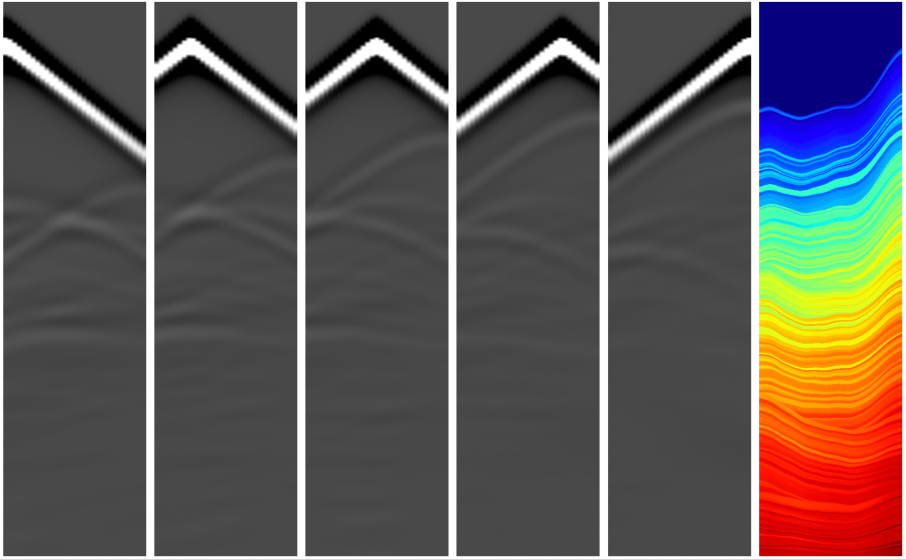

# Dark side of the volume

## 🗒️ Description

This repository contains the winning submissions for the [Speed and Structure Challenge](https://thinkonward.com/app/c/challenges/speed-and-structure) held by [ThinkOnward](https://thinkonward.com) in 2025. 

**The final submissions in this repository are all open source**. This should help inspire you to build on this work, amplify the impact of it by sharing your solutions with the global community, and encourage peer review and collaboration. You can find the winning models on the `speed-and-structure` [branch of the ThinkOnward HuggingFace Challenges model page](https://huggingface.co/thinkonward/challenges/tree/speed-and-structure) 🤗.

## ℹ About the challenge

### 🙋 Introduction

The goal of this challenge was to create velocity models from seismic shot records. ThinkOnward provided the data for this challenge in a typical data science challenge format, with five seismic shots for each target velocity model.  

### 🏗️ Challenge Structure

This challenge put participants in the driver's seat to develop cutting-edge techniques for seismic velocity inversion. Their mission? To construct high-resolution models of subsurface velocities from seismic data, unlocking valuable insights into the Earth's hidden structures. Just like tuning a high-performance machine, the winners needed to expertly handle complex data and innovative algorithms to achieve top speeds and accuracy in revealing the subterranean velocity landscape. This challenge tested their ability to transform raw seismic signals into detailed velocity models, a crucial step in various applications, from resource exploration to hazard assessment.

### 💽 Data

Participants were provided with 6,000 paired synthetic 2D seismic shot records and associated velocity models. The synthetic data were delivered as Numpy arrays.    

The Speed and Structure Data by Think Onward are licensed under the CC BY 4.0 license ([link](https://creativecommons.org/licenses/by/4.0/deed.en))

### 📏 Evaluation

For each sample in the test dataset, the mean absolute percentage error (MAPE) were calculated between the prediction and the ground-truth velocity model. These MAPEs were then averaged across all samples to determine the total MAPE for the test dataset. This total MAPE was used to rank solutions on the predictive leaderboard for this challenge.

### 👏 Knowledge Sharing
In keeping with our goal of collaboration and knowledge sharing, the winners solutions for this challenge are available in this directory for you to learn from and grow as a data scientist in the energy space. Remember to include license files and acknowledgements as part of the open-source community. 

